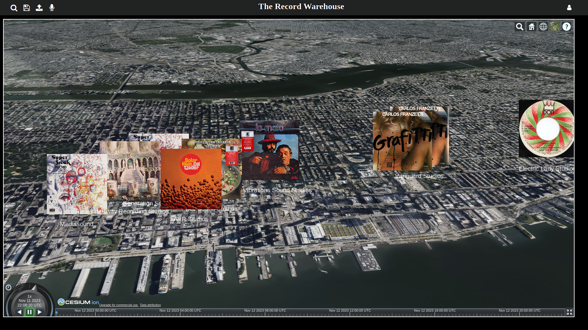
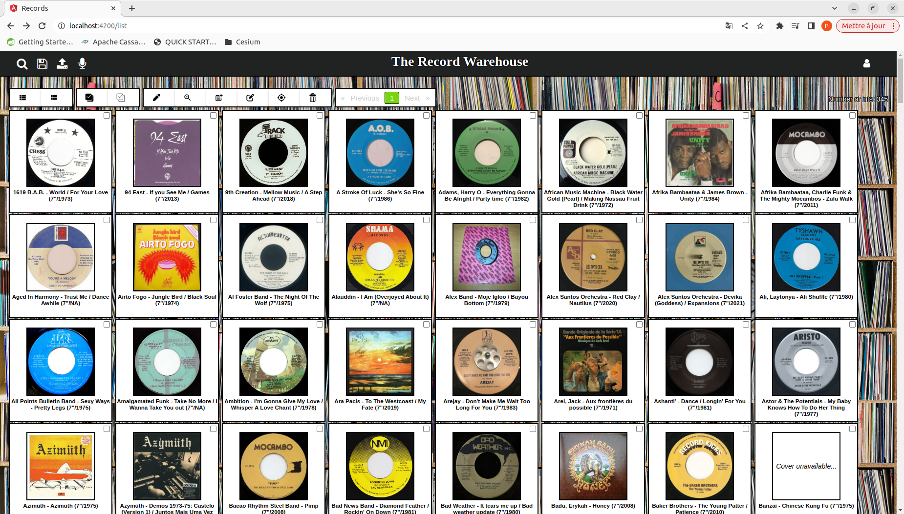
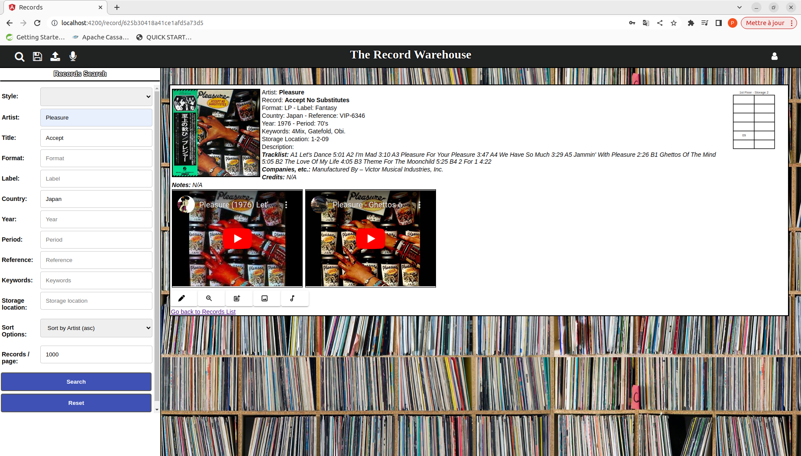
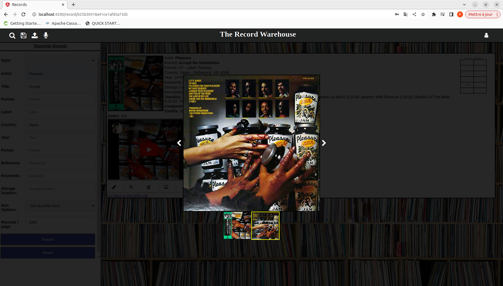
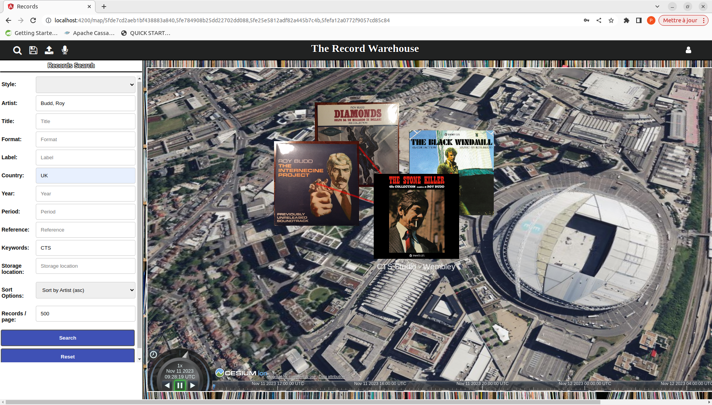
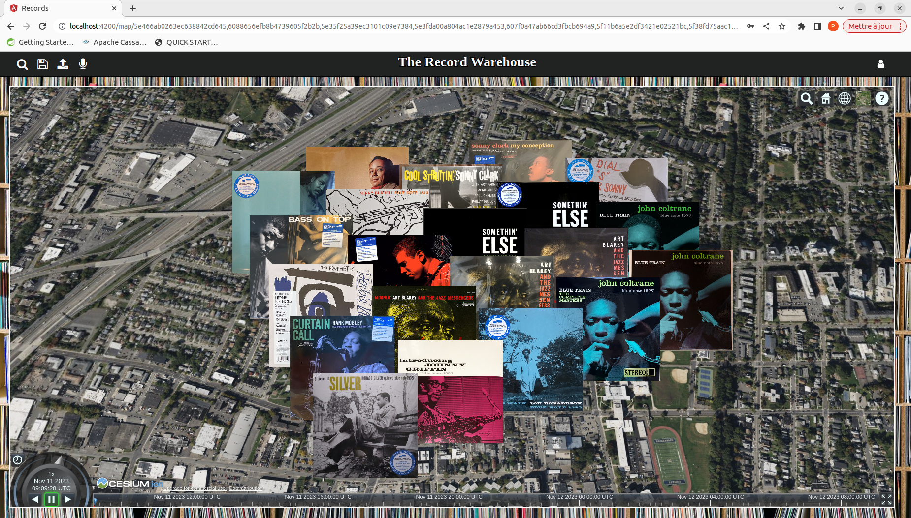

# Records

This project is an Angular frontend enabling to manage a vinyl record collection (at least mine... :). It is made to work with a NodeJS backend available at https://github.com/StephUgo/recordsbackend.

The main functions are:
  - Create / Read / Update and Delete (CRUD) records according to a simple model (Title, Artist, Label, Style, Keywords, Reference #, Attached Pics, ...) ;
  - Search records with several criteria ;
  - Display list of records (textual or cover based) ;
  - Fill studio and recording information ;
  - Locate recordings on a global map with a basic deconfliction algorithm.

See below for snapshosts which depict some of these functionnalities:

  - Some Soul/Funk classics recorded (partially at least) in Hollywood:

  - Some Latin Soul recorded in Manhattan:

  - Browse through some 7":

  - Display record details:

  - Display attached pictures:

  - Some record searches:
    - Some Roy Budd's soundtracks recorded at CTS Studios Wembley:

    - Some Blue Note LPs recorded by Rudy Van Gelder in his parents' house in the 50's (before moving to Englewood Cliffs ;):

    - Simple deconfliction algorithm for recordings made in the same studio (here several records made at Channel One in Kingston, btw all with Tony McDermott or Jamaal Pete covers) :

  - "Basic" responsive display for small screens:

  

This project is currently build with [Angular CLI](https://github.com/angular/angular-cli) version 17.

The software stack used for this development is quite straightforward, mainly : 
  - Angular ;
  - Cesium (through "angular-cesium" lib) ;
  - NgxPagination ;
  - RxJS ;
  - Font-awesome.

## Development server

Run `ng serve` for a dev server. Navigate to `http://localhost:4200/`. The app will automatically reload if you change any of the source files.

## Code scaffolding

Run `ng generate component component-name` to generate a new component. You can also use `ng generate directive|pipe|service|class|guard|interface|enum|module`.

## Build

Run `ng build` to build the project. The build artifacts will be stored in the `dist/` directory. Use the `--prod` flag for a production build.

## Running unit tests

Run `ng test` to execute the unit tests via [Karma](https://karma-runner.github.io).

## Running end-to-end tests

Run `ng e2e` to execute the end-to-end tests via [Protractor](http://www.protractortest.org/).

## Further help

To get more help on the Angular CLI use `ng help` or go check out the [Angular CLI README](https://github.com/angular/angular-cli/blob/master/README.md).
